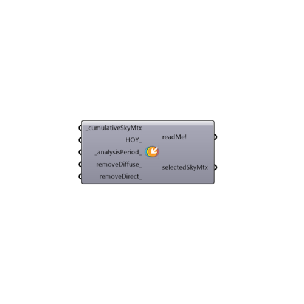

##  selectSkyMtx

Use this component to select a specific sky matrix (skyMxt) for an hour of the year or for an analysis period.
 -
 

#### Inputs
* ##### cumulativeSkyMtx [Required]
The output from a GenCumulativeSkyMtx component.
* ##### HOY [Optional]
An hour of the year for which you would like to select a sky.  This must be a value between 1 and 8760.
* ##### analysisPeriod [Default]
An analysis period from Analysis Period component.  This will override an input HOY (hour of the year).
* ##### removeDiffuse [Optional]
Set to "True" if you want to remove the diffuse component of the selected sky.
* ##### removeDirect [Optional]
Set to "True" if you want to remove the direct component of the selected sky.

#### Outputs
* ##### readMe!
...
* ##### selectedSkyMtx
The selected sky matrix (SkyMtx) for the input hour of the year or an analysis period.

[Check Hydra Example Files for selectSkyMtx](https://hydrashare.github.io/hydra/index.html?keywords=Ladybug_selectSkyMtx)