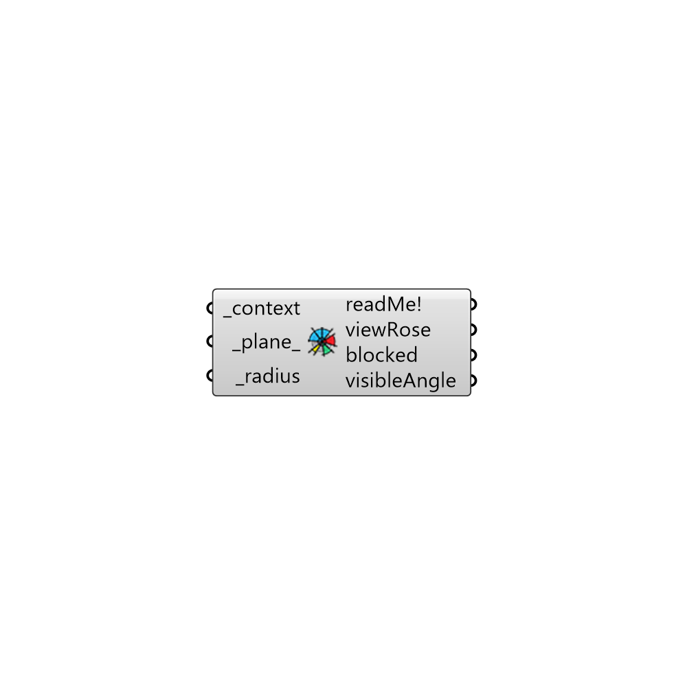

##  view Rose

Use this component to see the area visible from a given viewpoint across a 2D plane of vision.
 The component will create a circular surface in this plane of vision that is interrupted by context geometry to show the places that can be seen through this context geometry.
 -
 

#### Inputs
* ##### context [Required]
Breps or Meshes representing context geometry that can block the view around a given viewPoint.
* ##### plane [Default]
Test Plane
* ##### radius [Required]
A radius to make the view rose in Rhino model units. Note that, if the view rose is not extending past the _context geometry, you should increase this value.

#### Outputs
* ##### readMe!
...
* ##### viewRose
A surface representing the visible area from the viewpoint past the _context geometry.
* ##### blocked
A set of curves representing the views blocked by the _context geometry from the viewpoint .
* ##### visibleAngle
The total angle of visibility from the viewpoint in the plane of visibility.

[Check Hydra Example Files for view Rose](https://hydrashare.github.io/hydra/index.html?keywords=Ladybug_view Rose)